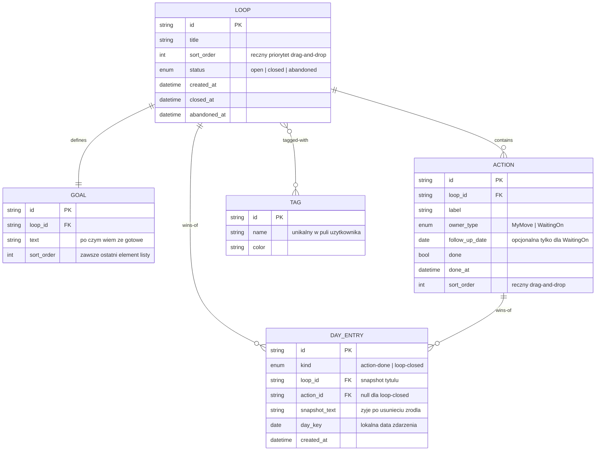

# Entity Map

## Diagram

Uwaga modelowa: „wątek zablokowany na innych" nie jest polem — jest **pochodną** (`derived`): Loop jest blocked, gdy ma co najmniej jedną akcję `WaitingOn` niezakończoną. Dziennik (`DayLog`) też nie jest tabelą — to **agregacja** `DAY_ENTRY` po `day_key` do widoku dnia i tygodnia.

## Entities

### Loop
**Description**: Otwarty wątek roboczy — podstawowa jednostka pracy. Zbiera akcje prowadzące do celu i ręczny priorytet na głównej liście.
**Instances per user**: Many (kilkanaście–dziesiątki jednocześnie otwartych).
**Ownership**: User (aplikacja single-user, brak encji User w danych).
**Lifecycle**: Powstaje w momencie dodania tematu; żyje jako `open`, aż użytkownik ręcznie go domknie (`closed`) albo porzuci (`abandoned`). Domknięte/porzucone można otworzyć ponownie; każdy wątek może być trwale usunięty wraz z zawartością.
**States**: `open` → `closed` (domknięcie ręczne przez osiągnięty cel — duże zwycięstwo w dzienniku), `open` → `abandoned` (porzucenie — nie jest zwycięstwem), `closed | abandoned` → `open` (przywrócenie).
**Contains**: Action (1:N), Goal (1:1), Tag (M:N), DayEntry (1:N jako źródło zdarzeń).
**Belongs to**: nic — wierzchołek grafu.

### Goal
**Description**: Krótki opis stanu „po czym wiem, że gotowe". Warunek domknięcia wątku.
**Instances per user**: Dokładnie jeden na Loop (relacja kompozycji — żyje i umiera z wątkiem).
**Ownership**: User (przez wątek).
**Lifecycle**: Tworzony razem z wątkiem (może zacząć pusty i zostać dopisany), edytowalny zawsze.
**States**: brak własnych stanów — wizualizacja „osiągnięto/nie osiągnięto" wynika ze statusu Loop.
**Contains**: —
**Belongs to**: Loop (1:1). **Wymóg UX**: renderowany jako ostatni element listy działań, przypięty — nie podlega przeciąganiu poza koniec.

### Action
**Description**: Konkretny krok do podjęcia w ramach wątku. Ma właściciela-zdarzenia: `MyMove` (mój ruch — liczy się do progresu) lub `WaitingOn` (czekam na kogoś — nie liczy się do progresu, może mieć datę dopytania).
**Instances per user**: Wiele na wątek (0–N).
**Ownership**: User (przez wątek).
**Lifecycle**: Dodana do wątku; przełącza `done`; usuwalna pojedynczo; znika z wątkiem przy twardym usunięciu.
**States**: `todo` ⇄ `done`. Odhaczenie **usuwa** powiązany wpis zwycięstwa z dziennika (bilans dnia wraca do stanu realnego).
**Contains**: —
**Belongs to**: Loop (1:N, sortowana ręcznie — `sort_order`).

### Tag
**Description**: Swobodna etykieta grupująca wątki (projekt, obszar, kontekst).
**Instances per user**: Współdzielona pula wielu tagów, używana przez wiele wątków (M:N).
**Ownership**: User.
**Lifecycle**: Powstaje przy pierwszym użyciu (wolne wpisywanie); rename działa globalnie na wszystkie wątki; usunięcie tagu odczepia go od wątków — nie usuwa wątków.
**States**: brak stanów domenowych.
**Contains**: —
**Belongs to**: Loop (M:N przez powiązanie).

### DayEntry
**Description**: Pojedynczy wpis zwycięstwa w dzienniku: skończona akcja (małe zwycięstwo) albo domknięty wątek (większe zwycięstwo). Trzyma snapshot tekstu, żeby historia była czytelna nawet po edycji/usunięciu źródła.
**Instances per user**: Wiele, append-log z jednym wyjątkiem (cofnięcie odhaczenia usuwa swój wpis).
**Ownership**: System (zapisuje automatycznie po zdarzeniach użytkownika — user nie tworzy wpisów wprost).
**Lifecycle**: Powstaje w chwili zdarzenia (akcja odhaczona / wątek domknięty); usuwany gdy odhacisz akcję z powrotem; przetrwa niezależnie od późniejszego twardego usunięcia wątku dzięki snapshotowi.
**States**: brak — rekord zdarzenia.
**Contains**: —
**Belongs to**: Loop i/lub Action (referencja + snapshot). Agregowany do **WeekSummary** (widok dziennika: nawigacja po tygodniu, bilans tygodnia, dzień po dniu).
