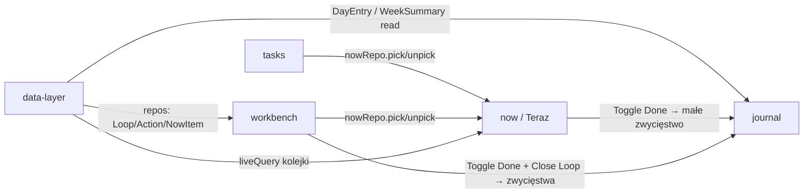

# Module Breakdown

## Overview

openloops to aplikacja o jednym ekranie roboczym (startowym), dwóch powierzchniach zarządzania i jednej refleksyjnej plus warstwa infrastruktury. Podział na 5 modułów projektowych odzwierciedla podział na powierzchnie UI plus infrastrukturę: **now / Teraz** (widok startowy i główny ekran pracy: dziś + ręczna kolejka wybranych akcji — dodany 2026-08-27, ADR-0020/0021), **tasks / Zadania** (katalog wszystkich zadań pogrupowanych po wątku, tylko wybór — 2026-08-27, ADR-0022), **workbench** (ekran autorski wątków: lista wątków po lewej + panel akcji z celem po prawej), **journal** (widok bilansu zwycięstw) i **data-layer** (Dexie/persistence pod wszystkim). Moduł **tags** wycofany decyzją użytkownika z 2026-08-27 — kod, encja `Tag` i tabela `tags` usunięte.

Zasada przepływu danych: workbench i Teraz *piszą* wpisy zwycięstw (`Toggle Done`, `Close Loop` → DayEntry); journal jest wyłącznie czytelnikiem; tasks niczego nie zmienia poza kolejką Teraz przez `nowRepo`. Wszystko stoi na data-layer.

## Modules

### now (Teraz)
**Type**: Core
**Description**: Widok startowy aplikacji i główny ekran pracy (ADR-0020). Dzisiejsza data z dniem tygodnia i żywym zegarem HH:MM nad ręcznie układaną kolejką akcji wybranych przełącznikiem „Teraz" — z listy Zadania albo prosto z panelu wątku. Drag & drop ustala porządek dnia; odhaczanie pisze dziennik identycznie jak w workbench; zrobione zostają w kolejce aż do świadomego zdjęcia (pojedynczo/masowo).
**Entities**: NowItem (wskaźnik na Action)
**Key Actions**: Read Day (data/zegar), Reorder Queue, Toggle Done in Queue, Remove From Queue (pojedynczo/masowo)
**Connects to**: data-layer (nowRepo + liveQuery join nowItems×actions×loops), tasks/workbench (wspólny stan wyboru `usePickedActionIds`)
**Design priority**: High — lądowanie aplikacji; kolejność i meta dnia muszą być natychmiast czytelne.

### tasks (Zadania)
**Type**: Core
**Description**: Katalog wszystkich zadań — akcje otwartych wątków pogrupowane per wątek (kolejność grup = priorytet wątków). Łatwy wybór „co robię dalej": przełącznik „Teraz" przy każdym wierszu dokłada/zdejmuje z kolejki. Powierzchnia celowo tylko-do-czytania-i-wyboru (ADR-0022): edycja treści/typów/usuwanie zostaje w workbench.
**Entities**: brak własnych (czyta Loop × Action, pisze NowItem przez nowRepo)
**Key Actions**: Browse Catalog, Pick For Now/Unpick, Open Workbench (stany puste)
**Connects to**: data-layer (odczyt), now (dzielą hook członkostwa i semantykę przełącznika)
**Design priority**: Medium — powierzchnia rozpoznawcza; spójność przełącznika z workbench ważniejsza niż bogactwo.

### workbench
**Type**: Core
**Description**: Ekran autorski aplikacji — podzielony na dwie kolumny. Lewa: ręcznie priorytetyzowana lista otwartych wątków (drag & drop) z progresem liczącym tylko akcje „mój ruch" i wskaźnikiem „czeka na innych"; zaznaczenie otwiera prawą stronę. Prawa: akcje zaznaczonego wątku z typami, ręczną kolejnością działań, opcjonalną datą dopytania oraz przypiętym na końcu celem-definition-of-done; tu zapada decyzja o domknięciu/porzuceniu. Wiersz akcji ma też przełącznik „Teraz" (ADR-0022) — dokłada krok do kolejki dnia.
**Entities**: Loop, Action, Goal
**Key Actions**: Add/Edit/Reorder Loops, Select Loop, Add/Edit/Toggle Done/Pick For Now/Reorder/Delete Action, Edit Goal, Close/Abandon/Reopen/Delete Loop
**Connects to**: data-layer (wszystkie zapisy przez repozytoria), journal (generuje DayEntry przy Toggle Done i Close Loop), now (pick toggle)
**Design priority**: High — najgęstsza interakcyjnie; tu żyje cały cykl życia wątku (lądowaniem jest już Teraz).

### journal
**Type**: Core
**Description**: Osobny widok dziennika zwycięstw. Nawigacja ← / → po tygodniach, tygodniowy bilans (ile małych zwycięstw = skończone akcje, ile większych = domknięte wątki) i podgląd dzień po dniu z godzinami. Wpisy trzymają snapshot tekstu, więc historia jest czytelna nawet po usunięciu lub edycji źródła.
**Entities**: DayEntry (agregacja do WeekSummary)
**Key Actions**: Open Journal, Navigate Weeks, Read Weekly Balance, Browse Day Entries
**Connects to**: data-layer (odczyt DayEntry); nie komunikuje się bezpośrednio z innymi modułami UI — spotykają się tylko na danych.
**Design priority**: Medium — mniej interakcji niż praca, ale największy ładunek motywacyjny; prostota przekazu ważniejsza niż bogactwo funkcji.

### data-layer
**Type**: Generic
**Description**: Infrastruktura trwałości zgodna ze wzorcem dopadone/dopawrite: schemat Dexie (IndexedDB, wersja 3) dla encji Loop/Action/Goal/DayEntry/NowItem, repozytoria jako jedyne API domenowe dla modułów UI, seed danych demo do prototypowania i czysty stan zerowy. DayEntry append-log z wyjątkiem cofnięcia odhaczenia; NowItem z kaskadowym sprzątaniem (ADR-0021).
**Entities**: wszystkie (definicja tabel i relacji z ENTITY_MAP.md)
**Key Actions**: brak akcji użytkownika — API programistyczne (CRUD encji, zapis zdarzeń zwycięstw, agregacja do WeekSummary)
**Connects to**: workbench, journal — każdy zapis/odczyt przechodzi tędy.
**Design priority**: Low (wizualnie brak) — natomiast High jako fundament implementacyjny tworzony w proto-devsetup przed wszystkimi modułami UI.

---

## Integration Map

## Prototyping Order

1. **data-layer** — nie jest modułem wizualnym, ale musi istnieć najpierw: scaffold Dexie + repozytoria + seed (proto-devsetup).
2. **workbench** — rdzeń wartości: dodaj wątek → rozpisz akcje → odhaczaj → domknij. Największa złożoność interakcji (dwa drag & drop, progresem, przypięty cel).
3. **journal** — jak workbench już generuje wpisy, bilans tygodnia daje pętlę zwycięstw; czyta wyłącznie dane, więc łatwo dokleić.
4. **now + tasks** (2026-08-27, ADR-0020..0023) — ekran pracy dnia i katalog wyboru; obie powierzchnie żyją na gotowych encjach i każą dorzucić tylko `NowItem` do schematu.

*(Były punkt 5 w pierwotnej kolejności — moduł tags — wycofany decyzją użytkownika 2026-08-27.)*

## Priority Areas

- **Przypięty cel przy reorderingu akcji (workbench)**: najtrudniejszy detal UX — drag & drop akcji nie może pozwolić przeciągnąć celu poza ostatnią pozycję; wyróżnienie celu musi być spójne z systemem.
- **Progres bar liczący tylko mój ruch (workbench)**: obietnica produktu; błędna arytmetyka niszczy zaufanie (bar staje, choć zrobiłem swoje). Musi też być zrozumiały, gdy wątek ma tylko akcje „czekam".
- **Moment domknięcia (workbench)**: przejście open → closed to chwila nagrody („cel osiągnięty") — przepływ informacji do dziennika musi być widoczny/nazwany, żeby zwycięstwo było poczute.
- **Czytelność bilansu (journal)**: jedna spojrzenie na tydzień ma odpowiadać na pytanie „ile zrobiłem" — hierarchia liczb vs. dni krytyczna.
- **Kolejka dnia (now)**: góra listy = następne w kolejce; doklejanie na koniec i kaskadowe czyszczenie muszą działać bezwyjątkowo, bo inaczej główny ekran pracy kłamie (ADR-0021/0023).
- **Rozdzielenie ról wybór vs. autoryzacja (tasks ↔ workbench)**: przełącznik „Teraz" wygląda i znaczy to samo w obu miejscach; katalog nigdy nie przeradza się w drugi panel edycji (ADR-0022).
