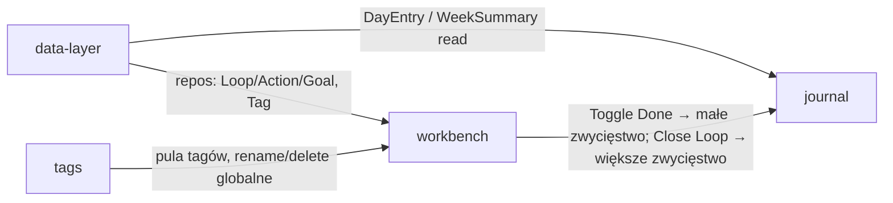

# Module Breakdown

## Overview

openloops to aplikacja o jednym dominującym ekranie i jednym widoku pobocznym. Podział na 4 moduły projektowe odzwierciedla podział na powierzchnie UI plus warstwę infrastruktury: **workbench** (ekran główny: lista wątków po lewej + panel akcji z celem po prawej — decyzja użytkownika z 2026-08-27: panele scalone w jeden moduł), **journal** (osobny widok bilansu zwycięstw), **tags** (wspólna pula etykiet) i **data-layer** (Dexie/persistence pod wszystkim).

Zasada przepływu danych: workbench jest jedynym *pisarzem* wpisów zwycięstw (`Toggle Done`, `Close Loop` → DayEntry); journal jest wyłącznie czytelnikiem. Tagi są biblioteką używaną przez workbench. Wszystko stoi na data-layer.

## Modules

### workbench
**Type**: Core
**Description**: Ekran główny aplikacji — podzielony na dwie kolumny. Lewa: ręcznie priorytetyzowana lista otwartych wątków (drag & drop) z tagami, progresem liczącym tylko akcje „mój ruch" i wskaźnikiem „czeka na innych"; zaznaczenie otwiera prawą stronę. Prawa: akcje zaznaczonego wątku z typami, ręczną kolejnością działań, opcjonalną datą dopytania oraz przypiętym na końcu celem-definition-of-done; tu zapada decyzja o domknięciu/porzuceniu.
**Entities**: Loop, Action, Goal (+ Tag jako atrybuty karty)
**Key Actions**: Add/Edit/Reorder Loops, Select Loop, Tag Loop, Add/Edit/Toggle Done/Reorder/Delete Action, Edit Goal, Close/Abandon/Reopen/Delete Loop
**Connects to**: data-layer (wszystkie zapisy przez repozytoria), journal (generuje DayEntry przy Toggle Done i Close Loop), tags (dobieranie tagów, tworzenie nowych przy wpisywaniu)
**Design priority**: High — codzienna powierzchnia robocza i najgęstsza interakcyjnie; tu żyje cały cykl życia wątku.

### journal
**Type**: Core
**Description**: Osobny widok dziennika zwycięstw. Nawigacja ← / → po tygodniach, tygodniowy bilans (ile małych zwycięstw = skończone akcje, ile większych = domknięte wątki) i podgląd dzień po dniu z godzinami. Wpisy trzymają snapshot tekstu, więc historia jest czytelna nawet po usunięciu lub edycji źródła.
**Entities**: DayEntry (agregacja do WeekSummary)
**Key Actions**: Open Journal, Navigate Weeks, Read Weekly Balance, Browse Day Entries
**Connects to**: data-layer (odczyt DayEntry); nie komunikuje się bezpośrednio z workbench — spotykają się tylko na danych.
**Design priority**: Medium — mniej interakcji niż workbench, ale największy ładunek motywacyjny; prostota przekazu ważniejsza niż bogactwo funkcji.

### tags
**Type**: Supporting
**Description**: Współdzielona pula swobodnych etykiet grupujących wątki. Tworzone przy pierwszym użyciu podczas wolnego wpisywania w workbench; zarządzanie globalne (rename wszędzie / usunięcie odczepiające) jako mały widok pomocniczy.
**Entities**: Tag
**Key Actions**: Create Tag (inline z workbench), Rename Tag, Delete Tag
**Connects to**: workbench (przypinanie tagów do wątków, filtr/kolor karty), data-layer (repozytorium tagów).
**Design priority**: Low — mała powierzchnia; inline częściowo Projektowana w ramach workbench, osobny widok zarządzania na końcu.

### data-layer
**Type**: Generic
**Description**: Infrastruktura trwałości zgodna ze wzorcem dopadone/dopawrite: schemat Dexie (IndexedDB) dla encji Loop/Action/Goal/Tag/DayEntry, repozytoria jako jedyne API domenowe dla modułów UI, seed danych demo do prototypowania i czysty stan zerowy. DayEntry append-log z wyjątkiem cofnięcia odhaczenia.
**Entities**: wszystkie (definicja tabel i relacji z ENTITY_MAP.md)
**Key Actions**: brak akcji użytkownika — API programistyczne (CRUD encji, zapis zdarzeń zwycięstw, agregacja do WeekSummary)
**Connects to**: workbench, journal, tags — każde zapisy/odczyty przechodzi tędy.
**Design priority**: Low (wizualnie brak) — natomiast High jako fundament implementacyjny tworzony w proto-devsetup przed wszystkimi modułami UI.

---

## Integration Map

## Prototyping Order

1. **data-layer** — nie jest modułem wizualnym, ale musi istnieć najpierw: scaffold Dexie + repozytoria + seed (proto-devsetup).
2. **workbench** — rdzeń wartości: dodaj wątek → rozpisz akcje → odhaczaj → domknij. Największa złożoność interakcji (dwa drag & drop, progresem, przypięty cel).
3. **journal** — jak workbench już generuje wpisy, bilans tygodnia daje pętlę zwycięstw; czyta wyłącznie dane, więc łatwo dokleić.
4. **tags** — na start wystarczą tagi inline przy wątku; osobny widok zarządzania pulą na końcu.

## Priority Areas

- **Przypięty cel przy reorderingu akcji (workbench)**: najtrudniejszy detal UX — drag & drop akcji nie może pozwolić przeciągnąć celu poza ostatnią pozycję; wyróżnienie celu musi być spójne z systemem.
- **Progres bar liczący tylko mój ruch (workbench)**: obietnica produktu; błędna arytmetyka niszczy zaufanie (bar staje, choć zrobiłem swoje). Musi też być zrozumiały, gdy wątek ma tylko akcje „czekam".
- **Moment domknięcia (workbench)**: przejście open → closed to chwila nagrody („cel osiągnięty") — przepływ informacji do dziennika musi być widoczny/nazwany, żeby zwycięstwo było poczute.
- **Czytelność bilansu (journal)**: jedna spojrzenie na tydzień ma odpowiadać na pytanie „ile zrobiłem" — hierarchia liczb vs. dni krytyczna.
